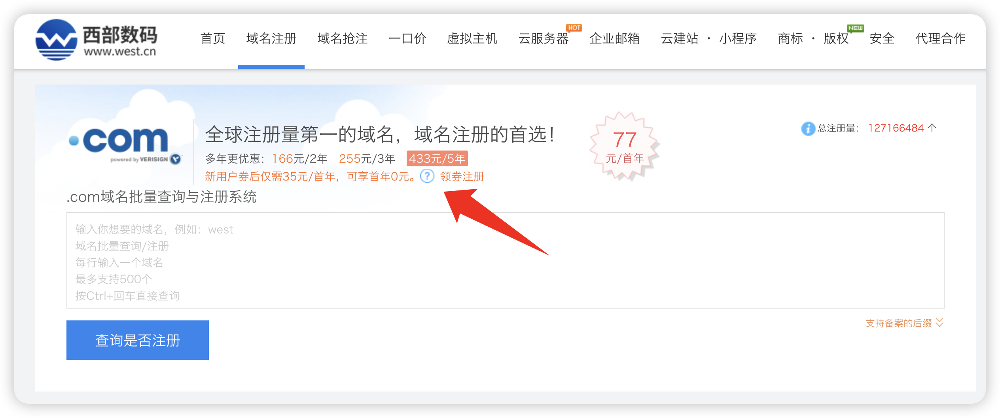
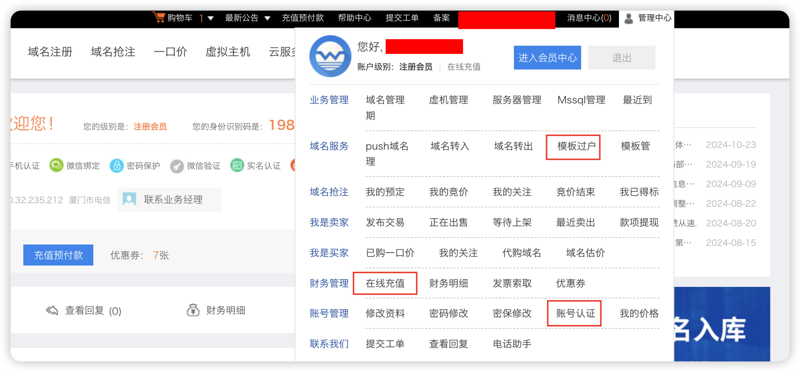
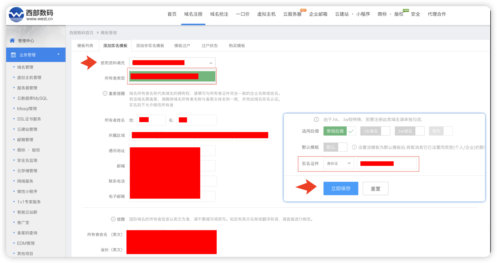
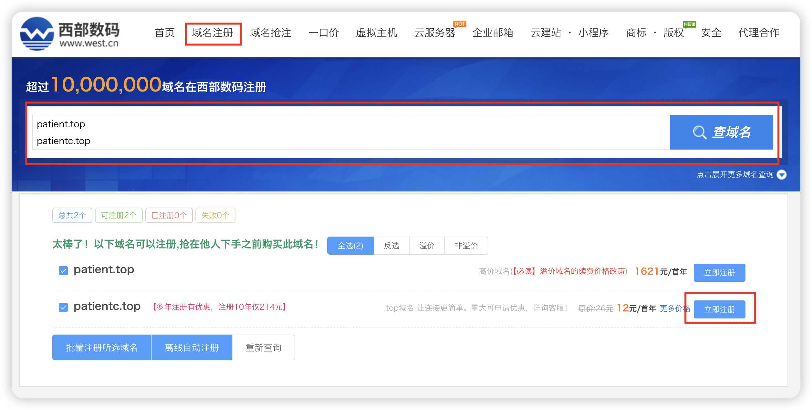
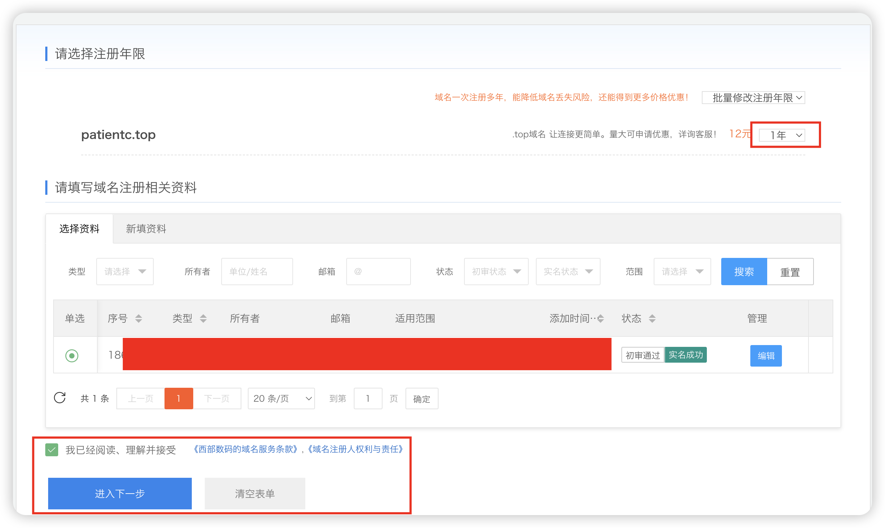
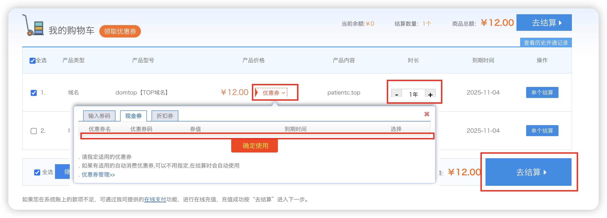
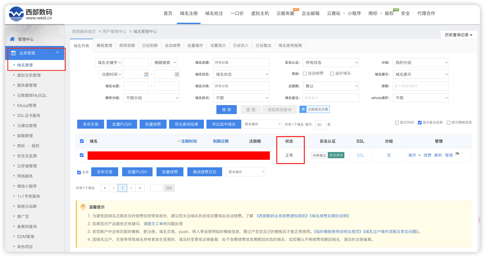
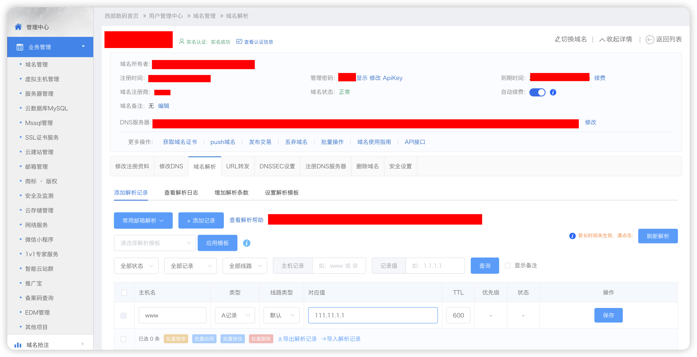

### **西部数码领劵新人首年一元.TOP 顶级域名可备案**

**申请国内顶级域名主要是为了备案能通过（使用腾讯云备案），不然使用免费的二级域名+cloudflare 托管的免费方案也是可以用的**

-   点击注册领劵
-   注册后登陆后再次访问这个界面
-   点击领取后微信扫码绑定即可领劵

```
# 官网
www.west.cn
# 新人链接直达
https://www.west.cn/domains/com.asp
```



### **注册领劵后首先要做的三件事**

-   焦点放在右上角管理中心

    

-   账号认证 （实名 略）
-   在线充值 （向账户充值一元 略）
-   模板过户 （添加过户模板）

        - 点击后选择添加实名模板
        - 使用资料填自己实名的信息
        - 填所有项目后重新填充身份证信息选择提交



### **申请域名**

-   点击域名注册
-   输入完整的顶级域名，top 和 cn 是最便宜也是能够备案的国内域名，如果需要免费的域名一般都是二级域名
-   这里推荐使用单词再加上一个其他字母，如果是一个单词的域名就会很贵
-   点击立即注册

    

-   下一步购买

        - 这里选择实名的信息并选择年限为一年

    

-   进入下一步后使用领取的优惠卷支付
-   使用之前充值的余额支付后获得域名

    

-   购买后现在域名还不能使用，还需要过户

    -   回到模板过户界面
    -   选择购买的域名
    -   选择之前的实名模板立即提交过户

-   过户前域名的状态是 `hold` 此时不能配置
-   提交过户后审核通过查看域名管理状态为正常域名就可以正常使用了

    

### **域名解析**

-   域名过户成功后点击域名列表右边的管理
-   添加解析记录
-   因为是国内的域名等待 2-5 分钟很快就生效

        - 这里使用腾讯和阿里的iP测试也可以

    

-   此时就可以使用命令行测试解析的结果

```
# 以域名patienc.top 的二级域名 www 为例
nslookup www.patientc.top

# 当解析为自己设定的值就是成功了
```

-   域名可用后就能立即在腾讯云申请免费 SSL 证书（一次 90 天可以一直申请）
-   <span style="color:red">在域名注册三天后就可以在腾讯云阿里云申请备案（腾讯和阿里云的域名访问硬性要求，如果没备案的域名绑定了它们的 IP，访问时会被拦截）</span>
